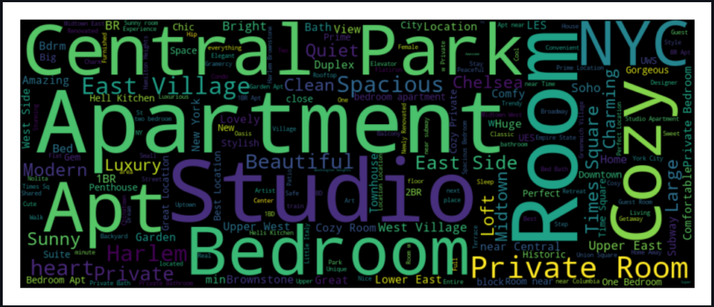

## Goal: Analysis of the most reviewed listings in different neighborhoods
This app is used to analyze the characteristics (e.g., room types, neighborhood groups, nearby sightseeing spots, prices, good qualities) of the most-reviewed listings in different neighborhoods. Here we assume that the more reviews a listing received, the more visitors it took and the more popular it is.

### Sidebar
This sidebar includes:
1. A select box which is used to select the neighborhood group to study
2. A slider which is used to choose the percentage of most-reviewed listings and set the scale of the study

The following components are used to study the listings selected according to the value chosen here.

### Map Visualization
A map is used to visualize room types and distributions of the most-reviewed listings in the selected neighborhood. 
By choosing this map view, users can directly compare the number and locations of listings of different room types and find the most popular choice under certain setting.  
Users can interact by zooming in to see the distribution of a certain region and tuning the values using the sidebar to conduct studies on different neighborhood groups and smaller or bigger group of listings.
An alternative of this function is to use histogram and barplot. However, this map view can group the listings in smaller sizes and present information of location and number at the same time.

### Displot
This displot is used to visualize the price distributions of all listings and the most reviewed listings. By clipping the value range, users can compare the two distributions more clearly and compare the number of listings from the groups easily. 
The visualization results show that most reviewed listings are generally the cheapest ones.

### Wordcloud 
Here we use wordcloud, which shows the most frequent phrases in the name of the most reviewed listings, to see why people tend to choose listings in certain neighborhoods and explore more qualities of these listings.

For example, by setting the chosen neighborhood group to **Manhattan** and percentage to **20**, the resulted words are shown below. 
This wordcloud function can reveal not only the most popular neighborhood and room type, but also some symbolic locations such as 'Central Park' and 'Time Square' that are more specific than neighborhoods.
This also shows the most favored descriptions such as **Sunny**, **Quiet** and **Clean**.

Also, the top 5 popular neighborhood names are returned by wordcloud and shown below the figure to give a more clear answer considering this aspect.

 ### Development process
I spent 8 hours on the developing. Learning how to use the map visualization took the most time.